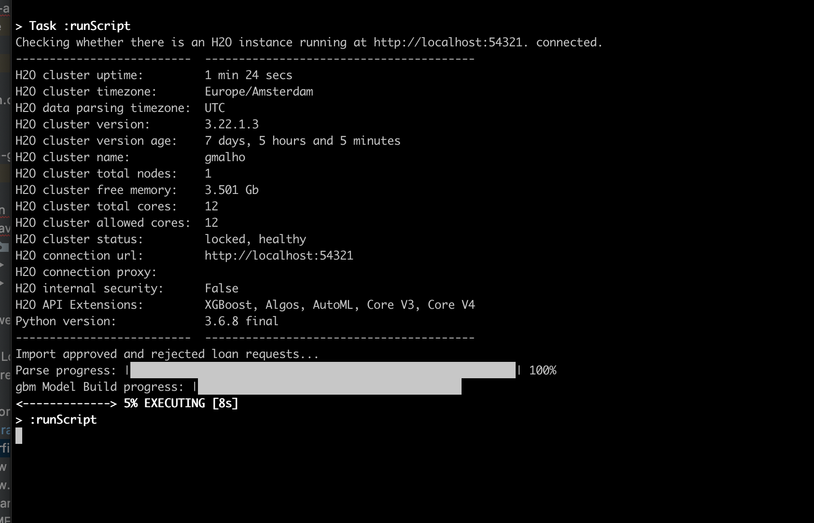

# Smart Application - Loan Approver Using Spring BOOT and ML

## Introduction

At Gonnect we believe in building architecture/platform which has deep learning using neural network at its core. Application build using such architecture are called "Smart Applications". In simple terminology, such application learns from data. 

As a demonstration checkout a GitHub project which builds a banking loan approval application. The goal of this application is to approve loan and provide interest rate. The loan approval & interest calculation is achieved using "Gradient Boost Models" - Binary, Classification & Regression based on dataset. Following are the key features demonstrated in application:

1. ML as a service using Spring Boot. 
2. Dockerize ML model + REST API
3. Polygot programming model. Loan Approver model & interest calculation is written in Python/R
4. The model is stored as POJO. 

NOTE: This is really interesting & unique as most example provided by Spring team via Spring Data Flow uses PMML model/TensorFlow. Spring BOOT is the framework of choice for building REST API. The new kid on block in Spring family for data pipeline orchestration is Spring Data Flow.

Deployment challenges of ML As a Service discussions in many enterprises can be summarized by a famous dialogue from Star Trek - " where no man has gone before" :-)

 Well it's not that an impossible task as it may be perceived at first glance. The “Loan Approver” app (ref Architecture) below is the testimony of it.

Further this approach provides ability to rollout new versions of the ML model after performing A/B testing.  This style of architecture:

1. Empower data scientist to use language (Python or R) & framework of their choice
2. Provides ease of production deployment because of dokerization
3. Provides ease of integrations of ML as the model (prediction) is exposed as REST API

The power of ML model can only be achieved if they are part of the applications and hence making application smarter. Data which is the real asset of an organisation will unlock its potential using such architecture. This example also demonstrates how ML model can be applied in rule based use cases.

Other uses cases where such architecture style plays important part are:
1. Health insurance fraud detection
2. ePayment card fraud detection
3. Retail (eCommerce) for predicting buy plans with ship plan with inventory stock in hand to enhance best use of the stock in hand
4. ......

## Loan Approver Application Overview
Smart applications are those that learns from data. A Loan Approver is smart application which will use ML for loan approving. Learning from the data is achieved using two predictive model:

- Find whether loan being predicted is atrocious  (yes/no)

- If the loan is atrocious, what interest to be offered?

This will achieved in following steps:

- Step 1: Create a model which will answer the question.
- Step 2: Find data which will help in creating the model
- Step 3: Once the model is created, it will be exported as Java POJO
- Step 4: Then the compile the Java based model using Gradle
- Step 5: Deploy this model on Spring Boot (Tomcat)
- Step 6: Expose answer to the question as REST API and also self contained Swagger UI

## Data Model

| Predictor Variable               | Description                                 | Units        |
|----------------------------------|---------------------------------------------|--------------|
| loan_amnt                        | Requested loan amount                       |  US dollars  |
| term                             | Loan term length                            |  months      |
| emp_length                       | Employment length                           |  years       |
| home_ownersh                     | Housing status                              |  categorical |
| annual_inc                       | Annual income                               |  US dollars  |
| verification_status              | Income verification status                  |  categorical |
| purpose                          | Purpose for the loan                        |  categorical |
| addr_state                       | State of residence                          |  categorical |
| dti                              | Debt to income ratio                        |  %           |
| delinq_2yrs                      | Number of delinquencies in the past 2 years |  integer     |
| revol_util                       | Revolving credit line utilized              |  %           |
| total_acc                        | Total accounts (number of credit lines)     |  integer     |
| longest_credit_length            | Age of oldest active account                |  years       |

 
 Dependent Variable                | Description                                 | Model Category         |
|----------------------------------|---------------------------------------------|------------------------|
| bad_loan                         | Is the loan like to be bad? => approved?    | Binomial Classification|
| int_rate                         | Predicted loan rate                         | Regression             |


Following picture shows flow of this smart loan approver application:


## Model Information

| Atrocious Loan Model                         | Interest Rate Model                              |
|----------------------------------------------|--------------------------------------------------|
|**_Algorithm_**:      GBM                     |**_Algorithm_**:      GBM                         |
|**_Model Category_**: Binary<br>Classification|**_Model Catelgory_**: Regression            |                
|**_ntrees_**: 100                             |**_ntrees_**: 100                                 | 
|**_max_depth_**: 5                            |**_max_depth_**: 5                                |
|**_learn_rate_**: 0.05                        |**_learn_rate_**: 0.05                            |
|**_AUC on valid_**: 0.685                     |**_MSE_**: 11.1                                   |
|**_Max F1_**: 0.2.2                           |**_R2_**:  0.424                                  |


## Tech Stack
- Build: Gradle
- ML: Python/R, H2o, Six
- REST API: Java, Spring Boot

NOTE: Create a virtual env and install Python 3.6+, H2o and Six modules before running the build scripts

## Play Time
- Build project
    ```
     ./gradlew build                    # Run R script (loan-approver-model.R) to generate POJOs
     ./gradlew build -PpythonBasedMLModel=true   # Run Python script (loan-approver-model.py) to generate POJOs
    ```
    
    
    
- Run Load Approver Spring Boot Application

    ```
     java -jar loanapprover-0.0.1-SNAPSHOT.jar
    ```
    
    Alternatively, Docker container can be launched as shown below:
        
        1. build docker image 
            
             docker build loanapprover .
            
        2. build docker image 
            
             docker run loanapprover 
            

-  Swagger Definition of the Load Approver application
    ```
    http://localhost:8080/swagger-ui.html
    ```
    
    
#### Output
```
{
  "labelIndex": 0,
  "label": "0",
  "classProbabilities": [
    0.8777492684744649,
    0.12225073152553513
  ],
  "interestRate" : 12.079950220424134
}
```
    
##### NOTES
- label interpretation

| label                         |  meaning                             |
|-------------------------------|--------------------------------------|
|1                              | atrocious - bad loan - not approved  |
|0                              | good loan - approved                 |

- Download h2o-genmodel.jar and store it in lib folder
    ```
    curl http://192.168.1.20:54321/3/h2o-genmodel.jar > h2o-genmodel.jar
    ```
- ML model can be visualized in H2o UI as shown below:


    
 
    


